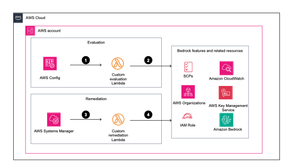

# AWS Bedrock Security Config Rules Pack

[](https://opensource.org/licenses/MIT)
[](https://aws.amazon.com/config/)
[](https://aws.amazon.com/cloudformation/)

A comprehensive AWS Config Rules Pack for implementing security controls across Amazon Bedrock deployments. Provides 21 automated security controls with remediation capabilities for Foundation Model Invocation (FMI) and RAG/Knowledge Base patterns.

## 🚀 Quick Start

**1. Clone the repository**
```bash
git clone https://github.com/your-org/bedrock-security-config-rules-pack.git
cd bedrock-security-config-rules-pack
```

**2. Customize parameters**
Edit `parameters/ssm-parameters.yaml` to configure:
- Which controls to deploy (DeployFMI01, DeployFMI04, etc.)
- Auto-remediation settings (EnableAutoRemediation)
- Control-specific configurations

**3. Deploy**
```bash
./scripts/deploy.sh --bucket your-unique-s3-bucket-name
```

**The deployment script automatically:**
- Deploys the SSM parameters stack with your customizations
- Creates the S3 bucket if it doesn't exist
- Packages and deploys only the enabled security controls
- Validates all prerequisites and provides helpful error messages

## 📋 Table of Contents

- [Security Controls](#-security-controls)
- [Architecture](#-architecture)
- [Installation](#-installation)
- [Testing](#-testing)
- [Contributing](#-contributing)
- [License](#-license)
- [Contributing](#-contributing)
- [License](#-license)

## 🔒 Security Controls

### ✨ Features
- **21 Security Controls** across Foundation Model Invocation and RAG patterns
- **Automated Remediation** for most non-compliant resources
- **Selective Deployment** - deploy only the controls you need
- **Parameter Store Integration** for centralized configuration
- **Multi-Account Support** with AWS Organizations
- **Real-time Monitoring** with AWS Config integration


### Foundation Model Invocation (FMI) Controls - 19 Controls

| Control | Name | Description | Auto-Remediation |
|---------|------|-------------|------------------|
| **FMI-01** | [Bedrock Wildcard Permissions Prohibited](controls/fmi-01-bedrock-wildcard-permissions-prohibited/) | Identifies IAM roles with overly permissive wildcard Bedrock permissions | ✅ |
| **FMI-02** | [Guardrails Enforced](controls/fmi-02-guardrails-enforced/) | Ensures SCPs mandate guardrail usage for Bedrock model invocations | ✅ |
| **FMI-03** | [Tag-Based Access Enforced](controls/fmi-03-tag-based-access-enforced/) | Validates IAM policies include tag-based conditions for Bedrock access | ✅ |
| **FMI-04** | [Model Invocation Logging Enabled](controls/fmi-04-model-invocation-logging-enabled/) | Ensures Bedrock model invocation logging is configured with proper destinations | ✅ |
| **FMI-05** | [Prompt Store Enabled](controls/fmi-05-prompt-store-enabled/) | Validates prompt versioning and management for governance | ⚠️ Manual |
| **FMI-06** | [Model Logs Encryption Enabled](controls/fmi-06-model-logs-encryption-enabled/) | Ensures model invocation logs use customer-managed KMS encryption | ✅ |
| **FMI-07** | [Knowledge Base Encryption Enabled](controls/fmi-07-knowledge-base-encryption-enabled/) | Validates knowledge base data sources use customer-managed KMS keys | ✅ |
| **FMI-08** | [Guardrail Encryption Enabled](controls/fmi-08-guardrail-encryption-enabled/) | Ensures guardrail configurations use customer-managed KMS encryption | ✅ |
| **FMI-09** | [VPC Endpoint Enabled](controls/fmi-09-vpc-endpoint-enabled/) | Validates VPC endpoints exist for private Bedrock connectivity | ✅ |
| **FMI-10** | [VPC Endpoint Policies Restricted](controls/fmi-10-vpc-endpoint-policies-restricted/) | Ensures VPC endpoint policies follow least privilege principles | ✅ |
| **FMI-11** | [Guardrail Topic Filters Enabled](controls/fmi-11-guardrail-topic-filters-enabled/) | Validates guardrails have topic-based content filtering configured | ✅ |
| **FMI-12** | [Guardrail Content Filters Enabled](controls/fmi-12-guardrail-content-filters-enabled/) | Ensures guardrails block harmful content types (violence, hate, etc.) | ✅ |
| **FMI-13** | [Guardrail Word Filters Enabled](controls/fmi-13-guardrail-word-filters-enabled/) | Validates guardrails filter blocked words and profanity | ✅ |
| **FMI-14** | [Guardrail PII Filters Enabled](controls/fmi-14-guardrail-pii-filters-enabled/) | Ensures guardrails detect and filter personally identifiable information | ✅ |
| **FMI-15** | [Guardrail Contextual Grounding Enabled](controls/fmi-15-guardrail-contextual-grounding-enabled/) | Validates contextual grounding and relevance filtering in guardrails | ✅ |
| **FMI-16** | [Guardrail Automated Reasoning Enabled](controls/fmi-16-guardrail-automated-reasoning-enabled/) | Ensures automated reasoning policies are configured in guardrails | ✅ |
| **FMI-17** | [CloudTrail Data Events Enabled](controls/fmi-17-cloudtrail-data-events-enabled/) | Validates CloudTrail captures data events for Bedrock resources | ✅ |
| **FMI-18** | [Guardrail Alarms Configured](controls/fmi-18-guardrail-alarms-configured/) | Sets up CloudWatch alarms for guardrail violation monitoring | ✅ |
| **FMI-19** | [Guardrail Change Monitoring Enabled](controls/fmi-19-guardrail-change-monitoring-enabled/) | Monitors and alerts on guardrail configuration changes | ✅ |

### RAG/Knowledge Base Controls - 2 Controls

| Control | Name | Description | Auto-Remediation |
|---------|------|-------------|------------------|
| **RAG-01** | [Knowledge Base Approved Sources Only](controls/rag-01-knowledge-base-approved-sources-only/) | Ensures knowledge bases only use approved and tagged data sources | ⚠️ Manual |
| **RAG-02** | [Vector Database Encryption Enabled](controls/rag-02-vector-database-encryption-enabled/) | Validates vector databases use customer-managed KMS encryption | ✅ |

> **Note**: Additional controls for RAG, Agentic AI, and model customization patterns are under consideration for future releases.

## 🏛️ Architecture



**Smart Compliance Engine:**
- Config rules trigger Lambda evaluations
- Lambda functions assess resource compliance
- Auto-remediation activates for violations
- Compliance restored automatically

**Two-Stack Architecture:**

```
┌──-───────────────────────────────────────────────────────────┐
│                 Parameter Stack                              │
│  ┌─────────────────────────────────────────────────────────┐ │
│  │           SSM Parameter Store                           │ │
│  │  • Global Parameters (/bedrock-configrules/global/*)    │ │
│  │  • Control Parameters (/bedrock-configrules/{id}/*)     │ │
│  │  • Environment-Specific Values                          │ │
│  └─────────────────────────────────────────────────────────┘ │
└────────────────────────────────────────────────────────────-─┘
                              ↓
┌─────────────────────────────────────────────────────────────┐
│                    Main Template                            │
├─────────────────────────────────────────────────────────────┤
│  ┌─────────────────┐  ┌─────────────────┐  ┌──────────────┐ │
│  │ SSM Parameter   │  │   Control 1     │  │  Control N   │ │
│  │   References    │  │     Stack       │  │    Stack     │ │
│  │                 │  │                 │  │              │ │
│  │ • Deploy Flags  │  │ • Config Rule   │  │ • Config Rule│ │
│  │ • Global Config │  │ • Lambda Func   │  │ • Lambda Func│ │
│  │ • SNS Topics    │  │ • IAM Roles     │  │ • IAM Roles  │ │
│  └─────────────────┘  │ • Remediation   │  │ • Remediation│ │
│                       └─────────────────┘  └──────────────┘ │
└─────────────────────────────────────────────────────────────┘
```

Each control is self-contained with:
- **AWS Config Rule** for compliance evaluation
- **Lambda Function** for custom compliance logic
- **Remediation Function** for automated fixes
- **IAM Roles** with least-privilege permissions

## Repository Organization

The repository follows a structured layout designed for maintainability and ease of contribution:

```
bedrock-security-config-rules-pack/
├── README.md                    # This file - project overview and quick start
├── CONTRIBUTING.md              # Contribution guidelines and standards
├── DEVELOPER_GUIDE.md           # Detailed development instructions
├── SECURITY.md                  # Security policy and vulnerability reporting
├── parameter_documentation.md   # Complete parameter reference guide
│
├── main-template.yaml           # Primary CloudFormation template
├── packaged-template.yaml       # Packaged template (generated during build)
│
├── controls/                    # Individual security controls
│   ├── README.md               # Controls overview and implementation guide
│   ├── fmi-01-bedrock-wildcard-permissions-prohibited/
│   │   ├── README.md           # Control-specific documentation
│   │   ├── TESTING.md          # Testing procedures and examples
│   │   ├── lambda_function.py  # Compliance evaluation logic
│   │   ├── remediation.py      # Auto-remediation implementation
│   │   └── template.yaml       # Control CloudFormation resources
│   ├── fmi-02-guardrails-enforced/
│   └── ... (additional controls)
│
├── parameters/                  # Configuration management
│   └── ssm-parameters.yaml     # SSM Parameter Store definitions
│
├── scripts/                     # Automation and deployment tools
│   ├── deploy.sh               # Main deployment script
│   └── cleanup.sh              # Resource cleanup utilities
│
├── docs/                        # Additional documentation
│   └── DEPLOYMENT_GUIDE.md     # Detailed deployment instructions
│
└── diagrams/                    # Architecture diagrams and visuals
    └── high_level_design.png   # System architecture diagram
```

### Key Directory Purposes

**`controls/`** - The heart of the project containing individual security controls:
- Each control is self-contained in its own directory
- Standardized structure: README.md, TESTING.md, lambda_function.py, remediation.py, template.yaml
- Controls follow naming convention: `{category}-{number}-{descriptive-name}`

**`parameters/`** - Centralized configuration management:
- `ssm-parameters.yaml` defines all SSM Parameter Store values
- Enables selective deployment and environment-specific customization
- Parameters organized by scope: global vs control-specific

**`scripts/`** - Deployment and maintenance automation:
- `deploy.sh` handles complete deployment lifecycle
- Includes validation, packaging, and error handling
- Supports multiple environments and deployment modes

**Root Files** - Project governance and templates:
- CloudFormation templates for infrastructure as code
- Documentation for contributors and users
- Configuration files for development tools

This organization supports:
- **Modular Development** - Add new controls without affecting existing ones
- **Easy Testing** - Each control has isolated test procedures
- **Selective Deployment** - Deploy only needed controls via parameters
- **Clear Documentation** - Standardized README and testing docs per control

## Installation

### Prerequisites

- AWS CLI installed and configured
- AWS Config enabled in your account
- IAM permissions for CloudFormation, Config, Lambda, S3, and SSM

### Parameter Configuration

Before deployment, you need to configure parameters in `parameters/ssm-parameters.yaml`. The parameters are organized into two categories:

**Global Parameters** (`/bedrock-configrules/global/*`)
These settings apply to all controls:
- **Deploy flags**: `DeployFMI01`, `DeployFMI04`, etc. - Set to `'true'` to enable specific controls
- **EnableAutoRemediation**: `'true'` or `'false'` - Enable automatic fixing of violations
- **ConfigRuleFrequency**: How often rules evaluate (`TwentyFour_Hours`, `One_Hour`, etc.)
- **NotificationTopicArn**: SNS topic for violation notifications
- **VpcId/SecurityGroupIds**: VPC configuration for Lambda functions (optional)

**Control-Specific Parameters** (`/bedrock-configrules/{control-id}/*`)
These settings configure individual controls:
- **FMI-01**: `MaxWildcardActions`, `AllowedActions`, `ProhibitedActions`
- **FMI-04**: `LoggingDestination`, `LogGroupRetentionDays`, `InvocationLogsS3BucketName`
- **FMI-12**: `ContentFilters`, `InputStrength`, `OutputStrength`
- **RAG-01**: `RequiredTags`, `ApprovedDataSourceTypes`

For detailed parameter explanations, see each control's README file in `controls/{control-id}/README.md`.

**Example customizations:**
```yaml
# Enable specific controls
DeployFMI01Param:
  Value: 'true'  # Enable wildcard permissions check

# Configure auto-remediation
EnableAutoRemediationParam:
  Value: 'true'  # Enable automatic fixes

# Control-specific settings
FMI17ContentFiltersParam:
  Value: 'SEXUAL,VIOLENCE,HATE,INSULTS'  # Required content filters
```

### Deploy

```bash
# Single command deployment
./scripts/deploy.sh --bucket your-unique-s3-bucket-name

# For different regions or profiles
./scripts/deploy.sh --bucket your-s3-bucket --region us-west-2 --profile production

# Update existing deployment
./scripts/deploy.sh --bucket your-s3-bucket --update
```

## 🧪 Testing

### Validate Deployment

```bash
# Check stack status
aws cloudformation describe-stacks --stack-name bedrock-security-configrules-pack

# Verify Config rules
aws configservice describe-config-rules --query 'ConfigRules[?starts_with(ConfigRuleName, `bedscr-`)].{Name:ConfigRuleName,State:ConfigRuleState}'

# View compliance status
aws configservice get-compliance-details-by-config-rule \
  --config-rule-name bedscr-fmi-04-model-invocation-logging \
  --query 'EvaluationResults[*].[ComplianceType,ConfigRuleInvokedTime]' \
  --output table
```

### Individual Control Testing

Each control includes detailed testing procedures:

```bash
cd controls/fmi-01-bedrock-wildcard-permissions-prohibited
cat TESTING.md  # Follow control-specific test procedures
```

## 🧹 Cleanup

```bash
# Remove security controls
aws cloudformation delete-stack --stack-name bedrock-security-configrules-pack

# Remove parameters (optional)
aws cloudformation delete-stack --stack-name bedrock-security-ssm-parameters
```

## 🤝 Contributing

See [CONTRIBUTING.md](CONTRIBUTING.md) for guidelines on adding new controls or improving existing ones.

### Adding New Controls

1. Create control directory: `controls/fmi-XX-new-control/`
2. Implement Lambda functions and CloudFormation template
3. Add control to main template with parameters
4. Document and test thoroughly

See [DEVELOPER_GUIDE.md](DEVELOPER_GUIDE.md) for detailed instructions.

## 📄 License

This project is licensed under the MIT License - see the [LICENSE](LICENSE) file for details.

---

**Ready to secure your Bedrock deployment?** Start with the [Quick Start](#-quick-start) above.
